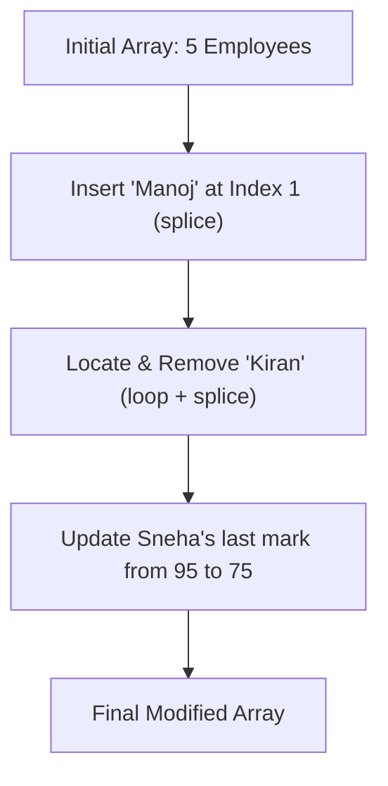

# Week 1: JavaScript Basics & Core Fundamentals

Welcome to the **Week 1** workspace of the MERN/Node stack assignments. This directory contains a curated set of introductory JavaScript assignments designed to build a strong foundation in syntax, control flow, functions, array manipulations, and object array operations.

---

## Directory Overview

| Script Name | Primary Concept | Data Structures | Core Logic / Operations |
| :--- | :--- | :--- | :--- |
| `bigIn2Nums.js` | Basic Conditional | Primitive Variables | Simple `if-else` comparison |
| `bigIn3Nums.js` | Multi-conditional Flow | Primitive Variables | Logical AND (`&&`) in compound conditions |
| `bigIn3Nums_passingNums.js` | Reusable Functions | Function Parameters | Parameterized conditional check with `return` values |
| `bigInNums_passingArr.js` | Functional Array Summing | Array & Function | Iterating array to calculate total sum |
| `sumOfMarks.js` | Array Iteration | Array | Iterative accumulation with a `for` loop |
| `leastMarks.js` | Array Search | Array | Finding the minimum value via sequential scan |
| `findIndexOfMarks.js` | Search Algorithm | Array & Function | Linear search returning matching index or `"not found"` |
| `emp_record_operations.js` | CRUD-like Operations | Array of Objects | In-place insertions, deletions (`splice`), and deep property updates |

---

## Detailed Script Breakdown

### 1. 🧮 Number Comparisons & Decision Making

#### 🔹 `bigIn2Nums.js`
- **Objective**: Identify the larger of two hardcoded numeric variables.
- **Inputs**: `firstNum = 10`, `secondNum = 20`
- **Logic Snippet**:
  ```javascript
  if (firstNum > secondNum) {
      console.log(`${firstNum} is greater than ${secondNum}`);
  } else {
      console.log(`${secondNum} is greater than ${firstNum}`);
  }
  ```
- **Output**: `20 is greater than 10`

#### 🔹 `bigIn3Nums.js`
- **Objective**: Extend comparison logic to find the largest of three numbers.
- **Inputs**: `firstNum = 10`, `secondNum = 20`, `thirdNum = 30`
- **Logic**: Employs an `if ... else if ... else` chain combined with logical AND (`&&`) operators to evaluate independent conditions.

#### 🔹 `bigIn3Nums_passingNums.js`
- **Objective**: Modularizes the 3-number comparison into a reusable helper function.
- **Signature**: `getTheLargest(firstNum, secondNum, thirdNum)`
- **Sample Run**:
  ```javascript
  console.log(`Greatest: ${getTheLargest(10, 70, 30)}`); // Returns 70
  ```

---

### 2. 📊 Array Processing & Calculations

#### 🔹 `sumOfMarks.js`
- **Objective**: Calculates the mathematical sum of all numeric elements in a marks array.
- **Mock Data**: `[70, 78, 65, 98]`
- **Implementation**: Initializes an accumulator `sum = 0`, iterates via standard index-based `for` loop, and prints:
  `Sum of the marks is 311`

#### 🔹 `leastMarks.js`
- **Objective**: Finds the minimum numeric value in a list of marks.
- **Logic**: Performs a linear scan, assuming the first element is the minimum (`min = arr[0]`), and updates `min` if any subsequent element is lower.
- **Output**: `smallest element in the array is 65`

#### 🔹 `findIndexOfMarks.js`
- **Objective**: Implements a search function to find the exact array index of a target element.
- **Signature**: `getIndex(arr, element)`
- **Behavior**: Returns `Index of X is Y` on match, or the string `"not found"` if the item does not exist.

> [!NOTE]
> **Filename Mismatch Warning**
> The file `bigInNums_passingArr.js` has a mismatch between its filename and its code description:
> * **Filename**: `bigInNums_passingArr.js` (suggests finding the maximum value in an array)
> * **Actual Content**: Implements `sumOfArr(arr)` to sum the elements of the array `[20, 30, 40, 50]`.
> * Keep this in mind when studying the codebase structure!

---

### 3. Advanced Object Array Manipulations

#### 🔹 `emp_record_operations.js`
This script simulates dynamic operations (Create, Read, Update, Delete) on an in-memory "database" of employee records, which are stored as an array of structured objects:



##### Operations Performed:
1. **Insert (Create)**: Employs `Array.prototype.splice(1, 0, newEmployee)` to insert a record at the second index without overriding existing records.
2. **Remove (Delete)**: Scans the array sequentially to find the element where `name === 'Kiran'`, then uses `splice(index, 1)` to remove it.
3. **Update**: Finds the object representing `'Sneha'` and alters her final mark directly:
   `employees[empIndex].marks[employees[empIndex].marks.length - 1] = 75;`

---

## How to Run the Scripts

Ensure you have [Node.js](https://nodejs.org/) installed on your machine. Open a terminal within the `Week 1` directory and execute:

```bash
# Run a specific script
node bigIn2Nums.js
node emp_record_operations.js
```

---

##  Key Takeaways
- **Conditional Logic**: Mastery of comparison operators and logical operators (`&&`, `||`).
- **Array Manipulation**: Utilizing native methods like `.splice()` for positional insertions and deletions.
- **Object Contexts**: Reading, nesting, and updating deep fields inside objects within an array.
- **Loop Traversal**: Working with index boundaries in sequential standard `for` loops.

