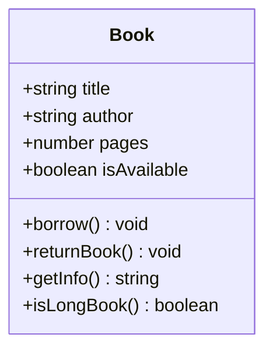

# 🚀 Week 2: Advanced JavaScript & Node.js Projects

Welcome to the **Week 2** workspace of the MERN/Node stack assignments. This directory represents a transition from basic programming blocks to advanced JavaScript concepts, object-oriented principles, modularity with ES modules, and building mock backend systems & REST APIs.

---

## Comprehensive Topic Directory

| Script / Folder | Advanced Concepts Covered | Primary Focus |
| :--- | :--- | :--- |
| `shallowCopy.js` | Spread Operator `{...}`, Reference Types | Distinguishing top-level primitives vs. nested object mutations |
| `deepCopy.js` | `structuredClone()` vs Shallow Copying | Deep cloning nested structures to avoid reference leakage |
| `copyAndExtend.js` | Array Rest/Spread Operator `[...]` | Non-mutating array extension strategies |
| `restParamSum.js` | ES6 Rest Parameters `(...args)` | Creating variadic function signatures for dynamic argument counts |
| `updateUser.js` | Object Spread & Extension | Merging objects and updating properties immutably |
| `LibraryManagement.js`| ES6 Classes, OOP, Constructor, Methods | Modeling real-world systems using class properties and actions |
| `bankTransaction.js` | HOFs (`.filter`, `.map`, `.reduce`, `.find`, `.findIndex`) | Processing banking transactions dynamically |
| `empPayrollProcessor.js`| HOFs & Object Transformation | Calculating bonuses, mapping payrolls, and summing total payouts |
| `movieRecommendation.js`| HOFs & Numerical Computations | Filtering categories and computing rating averages |
| `shoppingCart.js` | HOFs on Mock E-Commerce Data | Managing simple e-commerce items and inventory checks |
| `studentPerformance.js`| HOFs & Categorization Logic | Filtering grades and classifying performances dynamically |
| `examPortal.js` | Asynchronous Timers (`setTimeout`) | Simulating sequential real-time event delays |
| `otpCountdown.js` | Timers (`setInterval`, `clearInterval`) | Simulating real-time secure OTP countdown and resend events |
|  `Shopping-Cart-System/`| ES6 Modules, Inventory Control, Checkout | A fully decoupled, modular console e-commerce application |
|  `Task-Manager/` | Validation, ES Modules, Modular Architecture | Task management with isolated utility validations |
|  `UserProductAPI/` | Express.js, RESTful CRUD, API Routing | Full in-memory backend API with testing HTTP clients |

---

##  Standalone Script Breakdown & Mechanics

### 1.  Memory & Immutability Paradigms (Copying vs. Referencing)

#### 🔹 `shallowCopy.js`
Demonstrates that copying an object using the spread operator (`{ ...user }`) only clones the top-level keys. Nested structures remain referenced.
> [!WARNING]
> In `shallowCopy.js`, changing `userCopy.preferences.theme = "light"` mutates the **original** user's preferences because the `preferences` property is a reference pointer.

#### 🔹 `deepCopy.js`
Demonstrates true deep copying using the modern, native `structuredClone()` method.
> [!TIP]
> `structuredClone(object)` safely clones deep, nested object graphs, making sure modifications to `orderDeepCopy.customer.address.city` do not bleed into the original order.

#### 🔹 `copyAndExtend.js`
Demonstrates array immutability. Clones `fruits` into `moreFruits` and appends `"orange"` without mutating the original `fruits` array using the spread operator: `moreFruits = [...fruits, "orange"]`.

#### 🔹 `updateUser.js`
Demonstrates modifying and extending properties in one step using the spread syntax:
```javascript
let updateUser = { ...user, age: 25 };
```

---

### 2.  Modern Functional Paradigms (Higher-Order Array Methods)
These scripts practice essential array manipulation techniques:
- `.filter()`: Filters elements according to Boolean criteria.
- `.map()`: Transforms elements into new shapes (e.g., adding a field, scaling a value).
- `.reduce()`: Reduces arrays to single outputs (e.g., balance sum, averages).
- `.find()` / `.findIndex()`: Selects elements or indices based on match criteria.

#### 🔹 `bankTransaction.js`
- **Focus**: Processes transaction histories (`credit` / `debit` logs).
- **Insight**: Highlights how to pull subsets (credits only) and search for specific transaction sizes.

#### 🔹 `empPayrollProcessor.js`
- **Focus**: Simulates HR processes. Calculates a `netSalary = salary + 10% bonus` for every employee, then calculates the total corporate payroll payout.

#### 🔹 `studentPerformance.js`
- **Focus**: Sorts and maps grades based on custom logical thresholds:
  - $\ge 90$ $\rightarrow$ **A**, $\ge 75$ $\rightarrow$ **B**, $\ge 60$ $\rightarrow$ **C**, Else $\rightarrow$ **D**.

#### 🔹 `shoppingCart.js`
- **Focus**: Filters in-stock items, calculates individual item total prices, and scans for specific products.

> [!NOTE]
> **Performance Gotcha**
> In `shoppingCart.js`, the grand total is computed as:
> `let totalPrice = cart.reduce((acc, elem) => acc + elem.price, 0);`
> This sums the *unit prices* but does not factor in the item *quantities*. A production-grade accumulator would multiply price by quantity: `acc + (elem.price * elem.quantity)`.

---

### 3.  Asynchronous & Event-Driven Basics

#### 🔹 `examPortal.js`
Demonstrates asynchronous non-blocking code utilizing nested timers:
- **Instant**: Prints `"Exam submitted successfully"`
- **2-Second Delay**: Prints `"Evaluating answers..."`
- **4-Second Delay**: Prints `"Result: Pass"`

#### 🔹 `otpCountdown.js`
Implements a 10-second tick countdown for active OTP screens. Uses `setInterval` to log remaining time every second and automatically stops itself using `clearInterval` when `seconds === 0`.

---

### 4.  Object-Oriented JavaScript (OOP)

#### 🔹 `LibraryManagement.js`
Builds a cohesive system modeled via an ES6 class structure:

Shows how instances mutate internally (via `.borrow()` and `.returnBook()`) and arrays of instances are queried using helper methods.

---

##  Sub-Projects

###  [Shopping Cart System](file:///c:/MERN/NODE/MERN_Assignments/Week%202/Shopping-Cart-System)
A modular, production-ready console simulation demonstrating ES6 modules, inventory stock validation, percentage/flat promotional coupons, and UPI/Card checkout processing.

###  [Task Manager](file:///c:/MERN/NODE/MERN_Assignments/Week%202/Task-Manager)
A clean command-line application showcasing decoupling. Isolates user input validations (title length, date boundary check, and allowed values) from system-level array insertions.

###  [User & Product REST API](file:///c:/MERN/NODE/MERN_Assignments/Week%202/UserProductAPI)
An Express.js-powered API utilizing HTTP methods (`GET`, `POST`, `PUT`, `DELETE`) with in-memory persistence. Complete with an interactive `.http` testing client!

---

##  Running Standalone Scripts
From your terminal, execute:
```bash
node LibraryManagement.js
node deepCopy.js
```
