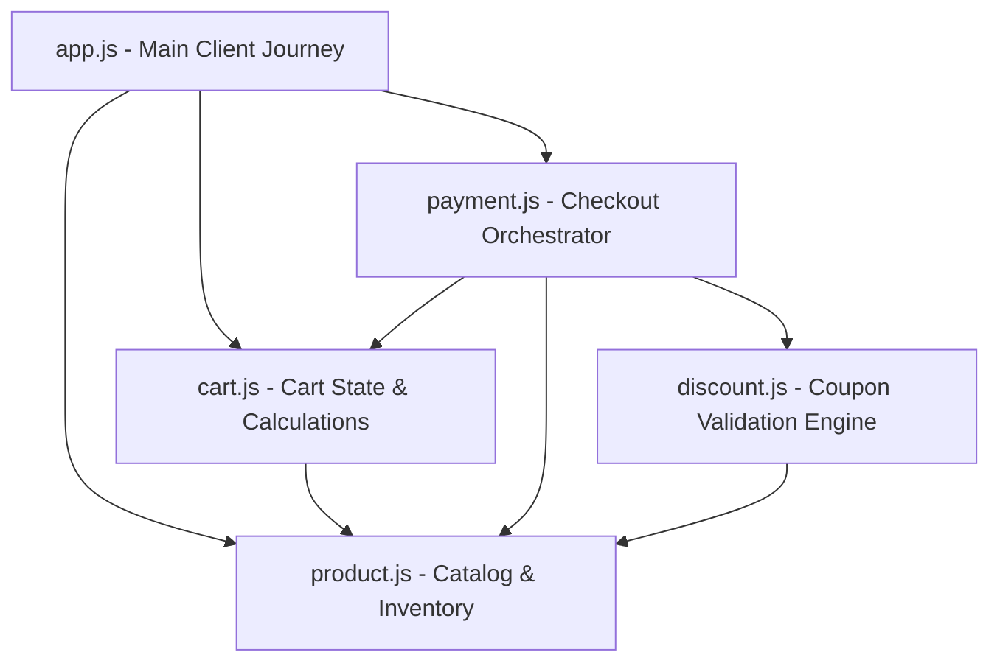

#  Advanced Shopping Cart & Checkout System

A lightweight, modular, simulated backend E-Commerce system engineered entirely in modern Node.js using **ES6 modules (`import`/`export`)**. This application showcases advanced modular structure, separation of concerns, inventory stock management, coupon rules engines, and simulated payment gateways.

---

##  Architectural Flow

The application is completely decoupled into dedicated concern layers. Below is the dependency and communication topology between modules:



---

##  Module Specifications

### 1. 📦 Product Catalog & Stock management (`product.js`)
Serves as the database abstraction layer for products.
- **Data Model**: `{ id, name, price, stock, category }`
- **Exposed Functions**:
  - `getAllProducts()`: Returns the full array of products.
  - `getProductById(productId)`: Looks up a specific product.
  - `getProductsByCategory(category)`: Retrieves products of a specific group (e.g., `'electronics'`).
  - `searchProducts(productName)`: Case-insensitive product search by name.
  - `checkStock(productId, quantity)`: Boolean check if stock level is sufficient.
  - `reduceStock(productId, quantity)`: Deducts purchased stock upon successful transaction.

### 2.  Shopping Cart API (`cart.js`)
Manages the in-memory cart array.
- **Data Model**: `{ id, quantity }`
- **Exposed Functions**:
  - `addToCart(productId, quantity)`: Adds items. Automatically merges quantities for existing items after validation.
  - `removeFromCart(productId)`: Deletes an item from the cart.
  - `updateQuantity(productId, newQuantity)`: Modifies the quantity of a cart product (guarded by stock availability checks).
  - `getCartItems()`: Hydrates basic cart records into full product details with total item valuations (`price * quantity`).
  - `getCartTotal()`: Calculates the absolute cart value using `.reduce()`.
  - `clearCart()`: Empties the cart upon checkout completion.

### 3.  Discount & Coupon Validation Engine (`discount.js`)
Validates and applies promotional campaign rules.
- **Configured Coupons**:
  - `WELCOME10`: **10% off** entire cart (Min. Spend: $1,000)
  - `FLAT500`: **$500 off** entire cart (Min. Spend: $5,000)
  - `ELECTRONICS20`: **20% off** (Min. Spend: $10,000, valid **ONLY** on products within the `'electronics'` category)
- **Exposed Functions**:
  - `validateCoupon(couponCode, cartTotal, cartItems)`: Validates code legitimacy, spending limits, and category constraints.
  - `calculateDiscount(couponCode, cartItems)`: Computes discount size, correctly filtering out ineligible items for category-restricted coupons.
  - `applyDiscount(cartTotal, cartItems, couponCode)`: Main interface returning original total, discount size, final total, and operation statuses.

### 4.  Checkout & Payment Gateway (`payment.js`)
Orchestrates the order completion pipeline.
- **Exposed Functions**:
  - `processPayment(paymentMethod, couponCode)`: Triggers verification, compiles discounts, validates checkout channels, reduces stock levels, empties the cart, and outputs a signed order summary.
  - `validatePaymentMethod(method)`: Validates that the client selected either `'card'`, `'upi'`, or `'cod'`.

---

##  Real-Time Checkout Simulation Walkthrough

When you execute `app.js`, the system performs the following sequential simulation:

1. **Catalog Query**: Fetches the inventory.
2. **Search**: Simulates a user looking up `"phone"`.
3. **Cart Building**:
   - Adds 2 Laptops (Success).
   - Adds 3 Headphones (Success).
   - Adds 1 more Laptop (Merges with existing laptop slot $\rightarrow$ Total: 3 Laptops).
4. **Modifications**:
   - Updates Laptop quantity to 2.
   - Deletes Headphones from cart.
5. **Checkout**: Processes payment via `UPI` using the `WELCOME10` code.
6. **Stock Reduction**: Decreases product stock.
7. **Reset**: Clears the shopping cart.

---

##  Execution & Sandbox Testing

Ensure you are within the `Shopping-Cart-System` directory, then run:
```bash
node app.js
```

### Example Order Summary Output:
```json
{
  "orderId": "ORD1716383610234",
  "items": [
    { "id": 1, "name": "Laptop", "price": 50000, "quantity": 2, "total": 100000 }
  ],
  "subtotal": 100000,
  "discount": 10000,
  "total": 90000,
  "paymentMethod": "upi",
  "status": "success",
  "message": "Payment successful"
}
```

---

##  Key Design Patterns
- **Dependency Isolation**: All direct stock updates are decoupled from the client (`app.js`) and encapsulated inside `payment.js`.
- **Validation Guard Clauses**: Returns structured payload objects `{ success, message }` or `{ valid, message }` to cleanly propagate error contexts without crashing the execution environment.
- **Higher-Order Array Optimization**: Employs `.some()`, `.reduce()`, `.map()`, and `.filter()` extensively for high-readability operations.

