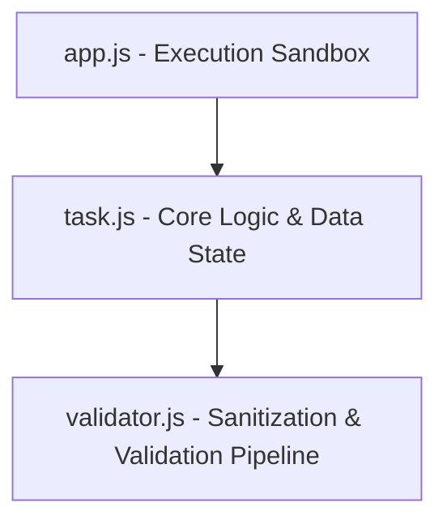

#  Modular Task Manager & Validation Pipeline

A highly decoupled, modular command-line **Task Manager Application** designed with modern JavaScript using **ES Modules (`import`/`export`)**. It highlights strict separation of concerns, input sanitization, and database-like arrays.

---

##  Architectural Decoupling

The codebase is strictly structured to isolate core application logic from user input validation, following clean architecture principles:



- **`validator.js`**: Pure functions. It carries no state and is only responsible for returning Boolean answers representing validity.
- **`task.js`**: Holds the state (`tasks` array) and handles mutations (`push` operations, mapping, finding indices).
- **`app.js`**: Main execution file simulating mock user transactions.

---

##  Validation Rules Matrix (`validator.js`)

All inputs are verified against strict schema boundaries before execution permissions are granted to the tasks database:

| Input Field | Validation Rules | JavaScript Internal Implementation |
| :--- | :--- | :--- |
| **Title** | Non-empty, minimum **3 characters** | `!title \|\| title.length < 3` |
| **Priority** | Must strictly equal `'low'`, `'medium'`, or `'high'` | Checks presence via `validPriorities.findIndex() === -1` |
| **Due Date** | Must represent a **future date/time** | Parses date, comparing `dueDateObj < new Date()` |

---

##  API Specifications (`task.js`)

### 1. `addTask(title, priority, dueDate)`
- **Behavior**: Passes inputs through the validation pipeline. If any field fails, the task insertion is rejected.
- **Auto-Generated Fields**:
  - `id`: Auto-incrementing numeric identifier starting from `1`.
  - `completed`: Defaults to `false`.
- **Returns**: Success (`"Task Added successfully"`) or failure (`"Task not added"`) feedback messages.

### 2. `getAllTasks()`
- **Behavior**: Retrieves the current collection of tasks inside the array.

### 3. `completeTask(taskId)`
- **Behavior**: Finds the index of the task matching `taskId` via `.findIndex()`.
- **Mutations**: Flips the `.completed` field to `true`.
- **Returns**: Formatted status messages showing success or dynamic error strings (e.g. `"task with Task Id X is not found"`).

---

##  Execution & Sandbox Simulation

Ensure you are within the `Task-Manager` directory, then run:
```bash
node app.js
```

### Simulation Flow in `app.js`:
1. **Adds 4 Tasks**:
   - `"Walk"` (Priority: `high`, Due: `2027-03-20`) $\rightarrow$ **Success**
   - `"play"` (Priority: `low`, Due: `2027-02-26`) $\rightarrow$ **Success**
   - `"sleep"` (Priority: `medium`, Due: `2027-05-07`) $\rightarrow$ **Success**
   - `"eat"` (Priority: `high`, Due: `2027-03-24`) $\rightarrow$ **Success**
2. **Display Catalog**: Outputs the created objects array.
3. **Complete Task**: Marks Task `1` (`"Walk"`) as completed.
4. **Display Updated State**: Shows the modified array with task `1` completed status.

---

##  Engineering Highlights
- **Decoupled Validation Engine**: `task.js` does not know *how* validation happens; it only reads Boolean responses from `validator.js`.
- **Clean In-Memory Persistence**: Utilizes closure-scoped variables (`tasks` array and `idCount` cursor) to manage database-like actions.
- **Fail-Fast Mechanics**: Functions yield immediate exits on invalid data, bypassing redundant executions.

