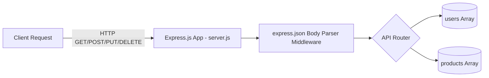

#  In-Memory User & Product Express REST API

A lightweight, robust, and highly functional **RESTful API** built using **Node.js** and the **Express.js** framework. This application simulates backend server mechanics using in-memory structures to perform CRUD (Create, Read, Update, Delete) operations on separate `users` and `products` resources.

---

##  Technical Architecture

The application is structured to serve as an entry point into HTTP-based backend servers:



- **Express Middleware**: Uses `express.json()` to automatically parse JSON payloads from client request bodies.
- **REST Protocol Standards**: Features clean HTTP verb mapping, URL route parameters (`:id`, `:brand`), and structured JSON response payloads.

---

##  REST API Endpoint Map

### 1. 👤 User Management API (`/users`)

| Method | Endpoint | Description | URL/Body Parameters | Expected JSON Payload / Output |
| :--- | :--- | :--- | :--- | :--- |
| **GET** | `/users` | Fetch all user profiles | None | `{ "message": "All Users", "payload": [...] }` |
| **GET** | `/users/:id` | Fetch a single user by ID | `:id` (Numeric Route Parameter) | `{ "payload": { "id": 103, "name": "Sushanth", "age": 18 } }` or `"User not found"` |
| **POST** | `/users` | Register a new user | Request Body (JSON) | `{ "id": 103, "name": "Sushanth", "age": 18 }` $\rightarrow$ `{ "message": "User Created" }` |
| **PUT** | `/users` | Modify an existing user | Request Body (JSON) | `{ "id": 103, "name": "Manoj", "age": 18 }` $\rightarrow$ `{ "message": "User Updated" }` |
| **DELETE** | `/users/:id` | Remove user profile | `:id` (Numeric Route Parameter) | `"User removed"` or `"User not found"` |

### 2.  Product Management API (`/products`)

| Method | Endpoint | Description | URL/Body Parameters | Expected JSON Payload / Output |
| :--- | :--- | :--- | :--- | :--- |
| **GET** | `/products` | Fetch full inventory list | None | `{ "message": "All Products", "payload": [...] }` |
| **GET** | `/products/:brand` | Fetch product by brand name | `:brand` (String Route Parameter) | `{ "payload": { "productId": 102, "name": "Laptop", "brand": "Dell", ... } }` |
| **POST** | `/products` | Add product to inventory | Request Body (JSON) | `{ "productId": 102, "name": "Laptop", "brand": "Dell", ... }` $\rightarrow$ `{ "message": "Product Created" }` |
| **PUT** | `/products` | Update product details | Request Body (JSON) | `{ "productId": 102, "name": "Mouse", "brand": "Lenovo", ... }` $\rightarrow$ `{ "message": "Product Updated" }` |
| **DELETE** | `/products/:id` | Purge product by ID | `:id` (Numeric Route Parameter) | `"Product removed"` or `"Product not found"` |

---

##  Installation & Server Initiation

1. **Verify Prerequisites**: Ensure you have [Node.js](https://nodejs.org/) installed.
2. **Install Dependencies**: Installs the required Express module specified in `package.json`.
   ```bash
   npm install
   ```
3. **Boot Server**: Launches the HTTP listener on `port 3000`.
   ```bash
   npm start
   ```
   *Terminal logs should display:* `server listening on port 3000...`

---

##  Live Endpoint Testing (`req.http`)

The project comes pre-configured with a `req.http` file. If you are using VS Code, install the **REST Client extension** to execute HTTP transactions directly from the IDE.

### Sample HTTP Requests inside the Client Sandbox:

```http
### Register a User
POST http://localhost:3000/users
Content-Type: application/json

{
    "id": 103,
    "name": "Sushanth",
    "age": 18
}

### Get User by ID
GET http://localhost:3000/users/103

### Update User
PUT http://localhost:3000/users
Content-Type: application/json

{
    "id": 103,
    "name": "Manoj",
    "age": 18
}
```

---

##  Implementation Details
- **In-Memory Operations**: Uses JavaScript array operations like `.findIndex()` to locate existing records and `.splice(index, 1, modifiedItem)` to perform updates or deletions.
- **Type Safety**: URL parameters are extracted as strings. The server parses IDs to numbers using `Number(req.params.id)` to prevent type mismatches during lookup operations.
- **Robust Error Handling**: Checks for `undefined` results or `-1` index values to gracefully return informative feedback messages (e.g. `"Product not found"`) instead of throwing exceptions.

